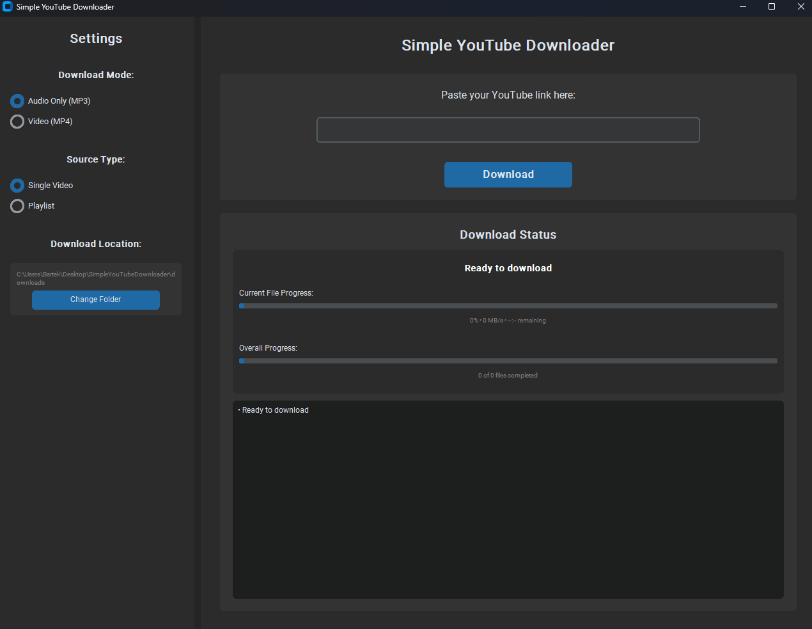
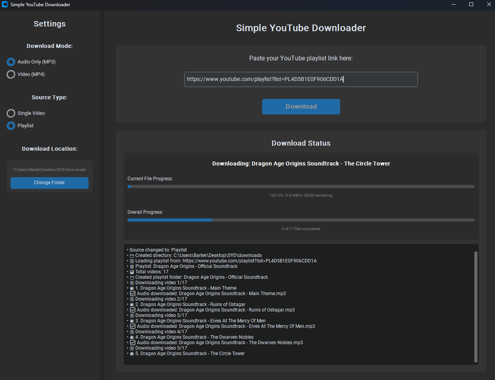
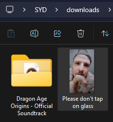

<!-- Improved compatibility of back to top link: See: https://github.com/othneildrew/Best-README-Template/pull/73 -->

<!--
*** Thanks for checking out the Best-README-Template. If you have a suggestion
*** that would make this better, please fork the repo and create a pull request
*** or simply open an issue with the tag "enhancement".
*** Don't forget to give the project a star!
*** Thanks again! Now go create something AMAZING! :D
-->

<!-- PROJECT LOGO -->
 

<h3 align="center">Simple YouTube Downloader</h3>

  

    Because download websites are too annoying
     
     
    <a href="#getting-started">Getting Started</a>
    &middot;
    <a href="https://github.com/Hefeii/simple-youtube-downloader/issues/new?labels=bug&template=bug-report---.md">Report Bug</a>
    &middot;
    <a href="https://github.com/Hefeii/simple-youtube-downloader/issues/new?labels=enhancement&template=feature-request---.md">Request Feature</a>
  

<!-- TABLE OF CONTENTS -->

  
Table of Contents

  <ol>
    <li>
      <a href="#about-the-project">About The Project</a>
      <ul>
        <li><a href="#features">Features</a></li>
        <li><a href="#built-with">Built With</a></li>
      </ul>
    </li>
    <li>
      <a href="#getting-started">Getting Started</a>
      <ul>
        <li><a href="#installation">Installation</a></li>
      </ul>
    </li>
    <li>
      <a href="#usage">Usage</a>
      <ul>
        <li><a href="#file-management">File management</a></li>
      </ul>
    </li>
    <li><a href="#license">License</a></li>
  </ol>

<!-- ABOUT THE PROJECT -->
## About The Project
Simple application for downloading audio/video from YouTube. 99% of work is already done by Pytubefix, I've just added a plain GUI with some quality of life additions.

  

### Features
* Download whole video (mp4) or just audio (mp3)
* Choice between downloading a single video or whole playlist
* While downloading from a playlist, files are saved in a separate folder with its name based on the playlist

(<a href="#readme-top">back to top</a>)

### Built With
* [Pytubefix][Pytubefix-url]
* [Tkinter][Tkinter-url]
* [CustomTkinter][CustomTkinter-url]
* [PyInstaller][PyInstaller-url]

(<a href="#readme-top">back to top</a>)

<!-- GETTING STARTED -->
## Getting Started

This application is basically a single Python script but to avoid having to manually install needed packages, I've packaged it using PyInstaller.

Unfortunately we can't use PyInstaller's _"--onefile"_ option with CustomTkinter, so the application is stored in compressed folder together with its internal files.

### Installation

1) Download a SimpleYouTubeDownloader zip file from latest release
2) Unpack it
3) Run app.exe

(<a href="#readme-top">back to top</a>)

<!-- USAGE EXAMPLES -->
## Usage

  

The goal was a very easy to use program so it's not complicated. The application window is split into two parts:
1) Settings panel on the left - where you can choose target file format, whether you wish to download from a single video or a playlist, and an option to change downloads folder location
2) Main panel on the right - where you paste the YouTube link, initialize download, and can monitor the ongoing downloading progress

### File management

  

By default, the application creates a "downloads" folder in the same directory as the .exe file. Based on the chosen source type, the files are saved in the following ways:
1) Single Video - loosely in the "downloads" folder
2) Playlist - application creates an additional folder inside "downloads" based on the playlist's name and stores the files inside

(<a href="#readme-top">back to top</a>)

<!-- LICENSE -->
## License

Distributed under the MIT License. See `LICENSE.txt` for more information.

(<a href="#readme-top">back to top</a>)

<!-- MARKDOWN LINKS & IMAGES -->
<!-- https://www.markdownguide.org/basic-syntax/#reference-style-links -->
[product-screenshot]: images/screenshot.png
[Pytubefix-url]: https://github.com/JuanBindez/pytubefix
[Tkinter-url]: https://docs.python.org/3/library/tkinter.html
[CustomTkinter-url]: https://github.com/tomschimansky/customtkinter
[PyInstaller-url]: https://github.com/pyinstaller/pyinstaller

